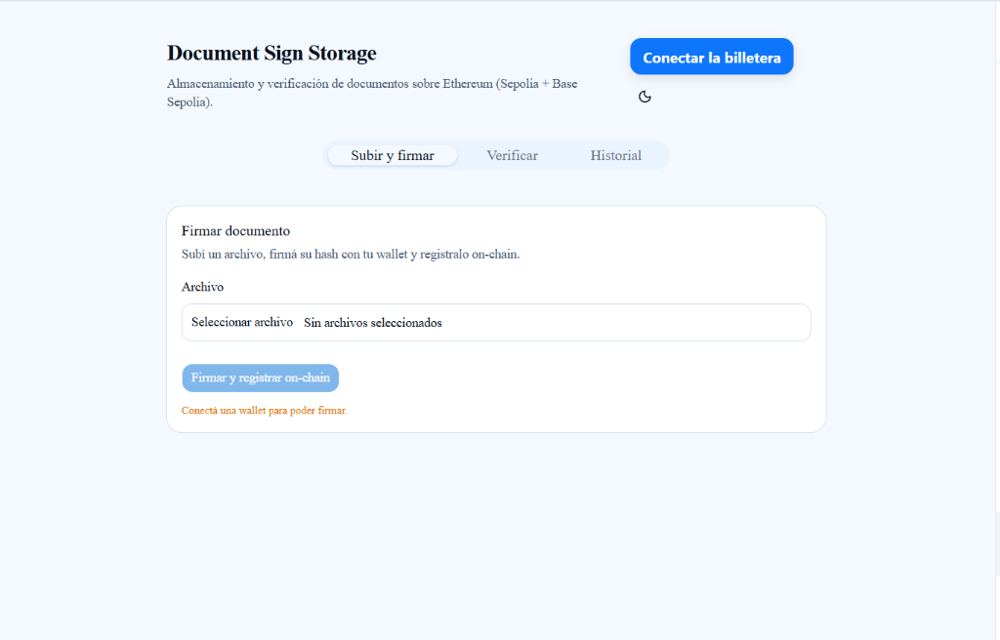
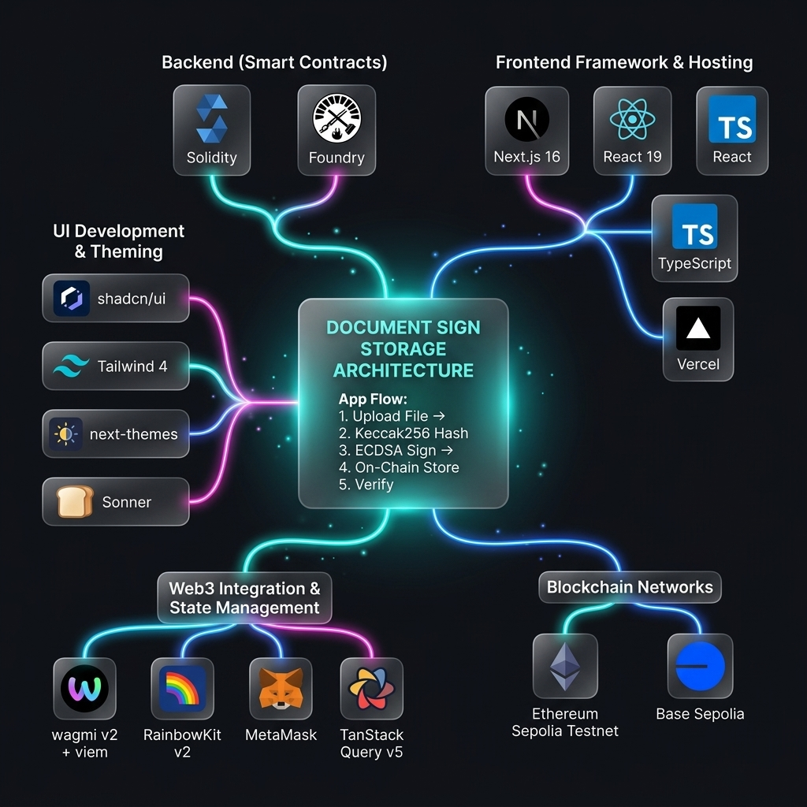

# Document Sign Storage

<div align="center">
  
</div>

dApp educativa (curso **CODECRYPTO**) para almacenar y verificar la autenticidad de documentos sobre Ethereum.

El usuario sube un archivo, el frontend calcula su `keccak256`, lo firma con una wallet (ECDSA) y persiste `hash + signature + timestamp + signer` on-chain. Cualquier persona puede luego volver a subir el mismo archivo y comparar el hash on-chain para verificar que no fue alterado y quién lo firmó.

🌐 **Demo en vivo:** https://document-sign-storage.vercel.app/

---

## 🎥 Video de Demostración

Para ver la dApp en acción y comprender todo el flujo de trabajo de firma y verificación paso a paso, puedes ver la demostración completa en video:

<div align="center">
  <a href="https://www.youtube.com/watch?v=JViYTTo-3Vg" target="_blank">
    
  </a>
  <br/>
  <br/>
  <a href="https://www.youtube.com/watch?v=JViYTTo-3Vg" target="_blank">
    
  </a>
</div>

---

## Casos de uso reales

El patrón "registrar el hash de un documento on-chain + firmar con ECDSA" sirve para cualquier escenario donde necesitás **probar que algo existió en un momento específico, sin revelar su contenido**. Ejemplos concretos:

| Caso | Cómo ayuda la blockchain |
|---|---|
| **Notarización digital** de contratos privados (NDAs, acuerdos comerciales, alquileres) | Reemplaza al notario para sellar la fecha y la identidad del firmante. Si después una parte alega no haber firmado, el verificador prueba que sí. |
| **Diplomas y certificados académicos** | La universidad firma el hash del PDF emitido. Cualquier empleador valida el diploma sin tener que llamar a la institución. |
| **Cadena de custodia legal** (evidencia digital, peritajes) | Cada archivo de evidencia se hashea + firma al momento de su recolección. Garantiza que no fue alterado entre la captura y la presentación en juicio. |
| **Propiedad intelectual / prior art** | Un diseñador o inventor firma el hash de su boceto antes de divulgarlo. Si después alguien lo patenta, hay prueba on-chain de la autoría previa. |
| **Auditoría de releases de software** | Cada vez que se publica un binario/source tarball se firma su hash. Los usuarios verifican que descargaron el archivo legítimo y no una versión modificada. |
| **Whistleblowing seguro** | El denunciante firma el hash de un documento sensible y lo registra. Después puede revelar el contenido a un periodista; el periodista demuestra que el documento existía en la fecha del registro, sin que el denunciante haya tenido que exponerse antes. |
| **Actas de directorio / minutas corporativas** | Compliance interno: cada acta se firma por los presentes y se registra. Auditorías futuras verifican integridad sin tener que confiar en el archivo del secretario. |
| **Provenance de objetos físicos** (arte, vinos, lujo) | El certificado de autenticidad se hashea y se firma por el productor. Compradores secundarios verifican antes de pagar. |

> En todos los casos, **el archivo nunca se sube** a la blockchain — solo su hash de 32 bytes. Eso preserva privacidad (el contenido queda offline) y mantiene el costo independiente del tamaño del archivo.

---

## Stack

<div align="center">
  
</div>

| Capa | Tecnología |
|---|---|
| Smart contract | Solidity ^0.8.20, Foundry (forge + cast) |
| Frontend | Next.js 16 (App Router) + React 19 + TypeScript |
| Web3 client | wagmi v2 + viem (sin ethers) |
| Connect wallet | RainbowKit v2 (modal + EIP-6963 multi-wallet picker) |
| UI | shadcn/ui (Radix/Base UI + Tailwind 4) + Sonner toasts |
| Estado de queries | TanStack Query v5 |
| Theming | next-themes (dark/light persistente) |
| Hosting | Vercel (production branch: `testnet`) |
| Redes | Sepolia (Ethereum testnet), Base Sepolia (L2 testnet) |

---

## Contratos deployados

`DocumentRegistry` está deployado en dos redes. La dApp lee la red activa de la wallet conectada y usa la dirección correspondiente.

| Red | chainId | Dirección | Explorer |
|---|---|---|---|
| Sepolia | `11155111` | `0x2c69e8071e842139dE4eFbc3A1597205098769aA` | [sepolia.etherscan.io](https://sepolia.etherscan.io/address/0x2c69e8071e842139dE4eFbc3A1597205098769aA) |
| Base Sepolia | `84532` | `0x73a621990B49DF359158100adF6E00F81ACDbfd3` | [sepolia.basescan.org](https://sepolia.basescan.org/address/0x73a621990B49DF359158100adF6E00F81ACDbfd3) |

El mapping vive en [`dapp/lib/contracts.ts`](./dapp/lib/contracts.ts). Para agregar una red nueva: deployar el contrato + agregar la entrada al mapping + agregar el chain a `dapp/lib/wagmi.ts`.

---

## Cómo probar la dApp deployada

1. Entrá a https://document-sign-storage.vercel.app/.
2. Click en **Connect Wallet** (RainbowKit ofrece MetaMask, Rainbow, Coinbase, WalletConnect, etc.).
3. Asegurate de estar en **Sepolia** o **Base Sepolia**. Si no tenés ETH de testnet, conseguilo gratis:
   - Sepolia: https://www.alchemy.com/faucets/ethereum-sepolia
   - Base Sepolia: https://www.alchemy.com/faucets/base-sepolia
4. Tab **Subir y firmar** → subí cualquier archivo → click **Firmar y registrar on-chain** → revisá el preview en el modal de confirmación y click **Sí, firmar** → confirmá la firma en la wallet.
5. Tab **Verificar** → resubí el mismo archivo → "Documento auténtico ✓" + signer + fecha.
6. Tab **Historial** → tu documento aparece en la tabla.
7. **Probá modificar el archivo** (renombrar un byte) y subilo en Verificar → "Documento no registrado".

Switch entre Sepolia y Base Sepolia desde el icono de red de RainbowKit — el badge en el header refleja la chain activa.

---

## Setup local

Prerrequisitos: Node 20+, [Foundry](https://book.getfoundry.sh/getting-started/installation), git.

```bash
git clone https://github.com/<tu-user>/documentSignStorage
cd documentSignStorage

# Smart contracts
cd sc
forge install   # baja forge-std

# Frontend
cd ../dapp
npm install
cp .env.local.example .env.local   # editá NEXT_PUBLIC_WALLETCONNECT_PROJECT_ID
```

### Variables de entorno

**`dapp/.env.local`:**

```bash
# Obligatorio — Project ID de Reown (antes WalletConnect Cloud).
# Gratis en https://cloud.reown.com.
NEXT_PUBLIC_WALLETCONNECT_PROJECT_ID=tu_project_id

# Opcional — tu RPC propio de Alchemy / Infura / QuickNode.
# Si lo dejás vacío, la dApp usa fallback entre RPCs públicos
# (publicnode.com, tenderly, blastapi). Recomendado setear el tuyo
# si el flujo de firma falla con "Request is being rate limited".
NEXT_PUBLIC_SEPOLIA_RPC_URL=
NEXT_PUBLIC_BASE_SEPOLIA_RPC_URL=
```

> Las direcciones de los contratos NO van en env vars — están en `dapp/lib/contracts.ts`.

**`sc/.env`** (solo si vas a deployar/verificar contratos):

```bash
SEPOLIA_RPC_URL=https://eth-sepolia.g.alchemy.com/v2/TU_ALCHEMY_KEY
BASE_SEPOLIA_RPC_URL=https://base-sepolia.g.alchemy.com/v2/TU_ALCHEMY_KEY
PRIVATE_KEY=0x...                    # cuenta con ETH de testnet
ETHERSCAN_API_KEY=TU_ETHERSCAN_KEY   # opcional, para verificar en explorer
```

### Correr el frontend en local apuntando a testnet

```bash
cd dapp
npm run dev
```

Abre `http://localhost:3000`. Mismo flujo que la versión en Vercel — usa los contratos en Sepolia/Base Sepolia.

---

## Comandos clave

### Smart contracts (`sc/`)

```bash
forge build                          # Compilar
forge test -vv                       # Tests con logs (objetivo: 11/11)
forge test --match-test <name>       # Correr un test individual
forge coverage                       # Cobertura
forge clean                          # Limpiar cache/ y out/
```

### Frontend (`dapp/`)

```bash
npm run dev      # development server (http://localhost:3000)
npm run build    # production build (lo mismo que corre Vercel)
npm run lint     # ESLint
```

### Inspeccionar contratos con `cast`

```bash
# Cantidad de documentos en Sepolia
cast call 0x2c69e8071e842139dE4eFbc3A1597205098769aA \
  "getDocumentCount()(uint256)" \
  --rpc-url https://ethereum-sepolia-rpc.publicnode.com

# Existe este hash en Base Sepolia?
cast call 0x73a621990B49DF359158100adF6E00F81ACDbfd3 \
  "isDocumentStored(bytes32)(bool)" 0x<hash> \
  --rpc-url https://base-sepolia-rpc.publicnode.com
```

---

## Deploy

### Smart contracts a una nueva red

Desde `sc/`, con `.env` configurado:

```bash
# Sepolia
forge script script/Deploy.s.sol \
  --rpc-url sepolia \
  --broadcast \
  --verify

# Base Sepolia
forge script script/Deploy.s.sol \
  --rpc-url base_sepolia \
  --broadcast \
  --verify
```

Las claves `sepolia` y `base_sepolia` vienen de `[rpc_endpoints]` en `foundry.toml`. La address deployada queda en `sc/broadcast/Deploy.s.sol/<chainId>/run-latest.json`.

Pegá esa dirección en `dapp/lib/contracts.ts` bajo el chainId correspondiente.

### Frontend a Vercel

Vercel está conectado al repo. Cualquier `git push origin testnet` dispara un redeploy a producción automáticamente. Para deployar tu propio fork:

1. Importá el repo en [vercel.com/new](https://vercel.com/new).
2. **Root Directory: `dapp`** (es monorepo).
3. **Production Branch: `testnet`** (Settings → Environments).
4. Pegá `NEXT_PUBLIC_WALLETCONNECT_PROJECT_ID` en Settings → Environment Variables.
5. Deploy.

---

## Decisiones de diseño no obvias

Documentadas en detalle en [`CLAUDE.md`](./CLAUDE.md). Resumen:

1. **El struct `Document` no tiene flag `bool exists`**. La existencia se infiere de `documents[hash].signer != address(0)`. Ahorra ~39% de gas en storage.
2. **El frontend usa wagmi + viem, no ethers**. El connect wallet va por RainbowKit (que internamente usa EIP-6963). No hay private keys en el cliente.
3. **Los RPC son públicos** (`http()` sin URL). Adecuado para testnet con tráfico bajo. Para producción real conviene Alchemy/Infura por rate limits.
4. **Las direcciones de los contratos están hardcoded** en `lib/contracts.ts`, no en env vars. Razón: cambiar de chain no debería requerir redeploy del frontend.
5. **`storeDocumentHash` no verifica la firma on-chain** — la verificación se hace en `verifyDocument`. Trade-off: el contrato persiste, el verificador valida (ahorra gas en el path crítico).

---

## Estudiar el código

Ver [`WALKTHROUGH.md`](./WALKTHROUGH.md) — recorrido pieza por pieza pensado para repasar después de haber construido el proyecto.

## Licencia

MIT — proyecto educativo del curso CODECRYPTO.
